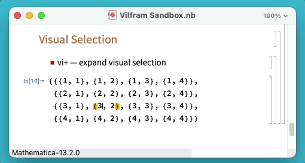

# Vilfram *— Vi for Wolfram*

Vi-like editing in Wolfram Notebooks

<!-- [[TODO: Feature overview GIF showing movement, selection expansion, etc. ]] -->

### Features

* Vilfram supports most of the standard Vi-like movement, selection, and
  deletion commands.

* Vilfram works in any file type that can be opened by the Wolfram front end,
  including: .nb, .wl, .wls, .wlt, and more.


## Getting Started

The [ConnorGray/Vilfram](https://paclets.com/ConnorGray/Vilfram) paclet can be
installed from [paclets.com](https://paclets.com) by evaluating:

```wolfram
PacletInstall["ConnorGray/Vilfram"]
```

Once installed, Vilfram will automatically be available and enabled in any
opened notebook.

[**Disabling Vilfram »**](#disabling-vilfram)

## Examples

#### Use `h`, `j`, `k`, and `l` keys for basic movement:


#### Switch between Insert and Command mode:

<!-- The current mode is indicated in the [Window Status Area][WindowStatusArea]: -->


#### Use `$`, `^`, `e`, and `b` to jump to the beginning and end of lines and words


#### Use visual selection to quickly copy, cut, and delete


#### Smart selection expansion to efficiently select the right subexpression




## All Supported Commands

The following Command-mode sequences are supported:

### Mode switching

* `i`, `a` — enter Insert mode
* `Esc` — enter Command mode

### Movement

Character-oriented:

* `h` — move single character left
* `l` — move single character right
* `j` — move single line down
* `k` — move single line up

Word-oriented:

* `e` — move to next word
* `b` — move to previous word

Line-oriented:

* `^` — move to beginning of line
* `$` — move to end of line

Document-oriented:

* `G` — move to top of notebook
* `gg` — move to end of notebook

### Visual Selection

* `v` — begin visual selection
  - `h` — change selection single character left
  - `l` — change selection single character right
  - `j` — change selection single line down
  - `k` — change selection single line up
  - `e` — extend selection to next word
  - `b` — extend selection to previous word
  - `^` — extend selection to beginning of line
  - `$` — extend selection to end of line

  - `y` — copy ("yank") current selection
  - `x` — cut current selection

### Deletion

* `de` — delete to next word
* `db` — delete to previous word
* `d^` — delete to beginning of line
* `d$` — delete to end of line

### Other

* `u` — undo
* `:w` — save current notebook
* `:x` — save and close current notebook

## Notable differences from Vi

Wolfram Notebooks are different in structure and supported functionality from
typically character-based editors.

* Structured selection commands

  Notebooks support a powerful and inuitive structural selection
  mechanism whereby the current selection can be expanded in steps that are each
  an enclosing syntactical structure.

  - `vi` — expands the selection each time `i` is pressed
  - `di+` — expands the selection each time `i` is pressed; deletes when the
  `Return` key is pressed

<!-- * No block caret

  Vi often distinguishes between Insert and Command mode by, respectively,
  changing the input caret between a block which is placed on a particular
  character, and a vertical bar which is placed in-between characters. -->


## Disabling Vilfram

> "Help! I installed Vilfram and now I'm stuck!"

**Don't panic.**
[You're not the first to get stuck in Vi.](https://stackoverflow.blog/2017/05/23/stack-overflow-helping-one-million-developers-exit-vim/)

To disable Vilfram, use your mouse to select the **Edit** > **Disable Vilfram**
menu item:


This will persistently disable Vilfram in the current and future sessions.

Use **Edit** > **Enable Vilfram** to re-enable Vilfram.


[WindowStatusArea]: https://reference.wolfram.com/language/ref/WindowStatusArea